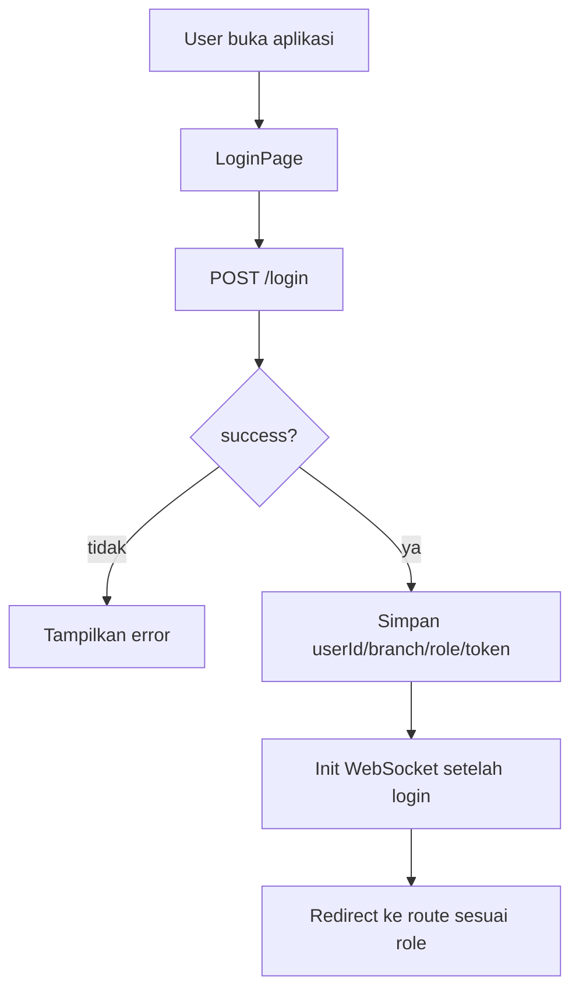

# Arsitektur Aplikasi Vanessa (vanessa3)

Dokumen ini menjelaskan arsitektur aplikasi **Vanessa** end-to-end: **Flutter client** (frontend) + **Express backend** + **PostgreSQL** + **storage uploads** + **realtime WebSocket**.

## Gambaran Umum

```text
+-------------------------+
|       FRONTEND          |  Flutter (Android/iOS/Web/Desktop)
|-------------------------|
| - Login + sesi user     |
| - Modul per role        |
| - REST API client       |
| - Realtime WS client    |
+-------------------------+
            |
            | HTTPS / REST API + WebSocket
            v
+-------------------------+
|       BACKEND API       |  Node.js (Express)
|-------------------------|
| - Auth JWT              |
| - Endpoint orders/items |
| - Payments              |
| - Uploads (/uploads)    |
| - WebSocket server      |
+-------------------------+
            |
            | SQL
            v
+-------------------------+
|       DATABASE          |  PostgreSQL
|-------------------------|
| - users / branches      |
| - orders / order_items  |
| - payments / stock_*    |
+-------------------------+
            |
            | File system
            v
+-------------------------+
|       STORAGE           |  backend/uploads/
+-------------------------+
```

## Repository Map (ringkas)

- **Frontend (Flutter)**: `lib/`
  - `lib/main.dart`: bootstrap app, global `userStateProvider`.
  - `lib/routes/app_routes.dart`: routing + login page + redirect sesuai role.
  - `lib/modules/`: fitur per role (struktur nyata ada di bagian “Modul Frontend”).
  - `lib/providers/`: Riverpod providers (daftar nyata ada di bagian “Providers”).
  - `lib/data/`: data layer & caching (`api_service.dart`, `offline_cache.dart`, `offline_database.dart`).
  - `lib/services/`: service layer (contoh: `offline_sync_service.dart`, `customer_service.dart`).
  - `lib/utils/`: util & infra (logging, print faktur/surat jalan, upload file, connectivity, dll).
  - `lib/pages/`: halaman global lintas modul (contoh: `switch_branch_role_page.dart`, `reporting_page.dart`).
- **Backend (Express)**: `backend/`
  - `backend/server.js`: app Express utama, middleware auth, mount routes, static uploads, websocket.
  - `backend/routes/`: implementasi endpoint (struktur nyata ada di bagian “Backend Routes”).
  - `backend/schema/`: SQL schema yang disimpan di repo (struktur nyata ada di bagian “Database”).
  - `backend/migrations/`: migrasi SQL.
  - `backend/db.js`: koneksi DB.
- **Dokumentasi lain** (opsional): `docs/arsitektur_aplikasi.md`, `docs/DOKUMENTASI_INDEX.md`, dll.

## Konfigurasi Network (Frontend)

Sumber kebenaran URL backend ada di `lib/utils/network_config.dart`.

- **HTTP base URL**: `NetworkConfig.baseUrl` → `https?://<host>` (saat ini port tidak dipakai)
- **WebSocket URL**: `NetworkConfig.wsUrl` → `wss?://<host>` (saat ini port tidak dipakai)
- **Header default**: `NetworkConfig.defaultHeaders`
  - otomatis menyertakan `Authorization: Bearer <token>` bila tersedia.

Catatan: skema HTTP/WS bisa menyesuaikan web (mengikuti `Uri.base.scheme`) agar aman dari mixed-content.

## Port & Deployment (penting)

Di repo ini ada **2 fakta** yang perlu diketahui supaya tidak salah konfigurasi:

- **Flutter** saat ini mengarah ke **`https://<host>` (port default 443)** (lihat `NetworkConfig.baseUrl`).
- **Backend Express** default listen di **port 3000** (lihat `backend/app.js`: `process.env.PORT || 3000`).

Artinya, environment production/dev bisa salah satu dari skenario berikut:
- **Ada reverse-proxy / gateway** (mis. Nginx/Cloudflare) yang memetakan `https://mobile.vanessa.id` (443) → backend Express (3000).
- **PORT env backend** di-set berbeda saat deploy (mis. backend listen langsung di 4000/443), dan `NetworkConfig` harus mengikuti.

Dokumen ini **tidak mengubah kode**; bagian ini hanya untuk mencegah miskonfigurasi ketika deploy.

### Contoh reverse-proxy (Nginx)

Skenario paling umum: **TLS termination di Nginx** dan proxy ke Express di localhost:3000.

```nginx
server {
  listen 443 ssl;
  server_name mobile.vanessa.id;

  location / {
    proxy_pass http://127.0.0.1:3000;
    proxy_http_version 1.1;
    proxy_set_header Host $host;
    proxy_set_header X-Forwarded-Proto $scheme;
    proxy_set_header X-Forwarded-For $proxy_add_x_forwarded_for;
  }
}
```

### Environment variables backend

Contoh file: `backend/.env.example` (jangan commit secret, `.gitignore` sudah memblok `backend/.env`).

## Autentikasi & Sesi (Frontend)

### Data sesi yang disimpan

Sesi user dikelola oleh `lib/core/state/user_state.dart` dan dipakai global lewat `userStateProvider` (didefinisikan di `lib/main.dart`).

State utama:
- `userId` (int?)
- `username` (string)
- `branch` (string)
- `role` (string; contoh: `cs`, `kasir`, `superadmin`, dst)
- `authToken` (JWT)
- `roles` (list role user)
- `branches` (list cabang user)

Persistensi:
- metadata user disimpan di `SharedPreferences`
- token disimpan di `FlutterSecureStorage`

### Alur login → redirect role

Implementasi login berada di `lib/routes/app_routes.dart` (di `LoginPage`).



## Modul Frontend (berdasarkan role)

Struktur fitur utama per role berada di `lib/modules/<role>/`.

Role yang benar-benar ada sebagai folder di repo (struktur nyata):
- `lib/modules/admin_toko/`
- `lib/modules/admin_workshop/`
- `lib/modules/cs/`
- `lib/modules/dashboard/`
- `lib/modules/kasir/`
- `lib/modules/manajer/`
- `lib/modules/stockist/`
- `lib/modules/superadmin/`
- `lib/modules/tukang/`

Setiap modul biasanya berisi `pages/` (screen) dan kadang `widgets/` atau helper.

## Arsitektur Data & State (Riverpod)

Pola umum:
- UI (`pages/`) membaca state dari `Provider`/`StateNotifierProvider`.
- Networking dilakukan melalui `http` langsung (di beberapa page) atau helper (`ApiService`).
- Token auth disuntikkan via `NetworkConfig.defaultHeaders`.

Realtime:
- `lib/providers/websocket_provider.dart` menyediakan:
  - `webSocketProvider` (channel)
  - `notificationProvider` (stream notifikasi string)
  - `healthCheckProvider` (indikator backend reachable via HTTP)

## Providers (struktur nyata)

Daftar provider yang ada di `lib/providers/` (nama file sesuai repo):
- `lib/providers/customer_provider.dart`
- `lib/providers/manager_dashboard_provider.dart`
- `lib/providers/network_provider.dart`
- `lib/providers/order_today_provider.dart`
- `lib/providers/store_dashboard_provider.dart`
- `lib/providers/system_dashboard_provider.dart`
- `lib/providers/technician_dashboard_provider.dart`
- `lib/providers/websocket_provider.dart`
- `lib/providers/workshop_dashboard_provider.dart`

## Alur Kasir: Pembayaran & Rekap Harian

### 1) Antrian pembayaran

`lib/modules/kasir/pages/payment_queue_page.dart`
- GET `.../orders/pending-payment?branch_id=<branch>`
- menampilkan daftar order yang belum dibayar untuk cabang aktif.

### 2) Proses pembayaran

`lib/modules/kasir/pages/payment_page.dart`
- POST `.../payments`
- payload menyertakan:
  - `order_id`, `amount`, `method`, `notes`
  - **`user_id`** (dari user login)
  - **`branch_id`** (cabang aktif)

### 3) Pembayaran “Hari Ini”

`lib/modules/kasir/pages/daily_payments_page.dart`
- GET `.../payments/daily-summary`
- query utama:
  - `branch_id=<branch>`
  - `date=YYYY-MM-DD`
  - **`user_id=<user login>`** (untuk membatasi transaksi milik user yang login)

## Realtime (WebSocket)

### Tujuan
- update UI lebih cepat untuk event seperti pembayaran selesai / order berubah status.

### Arsitektur client

`WebSocketNotifier`:
- connect setelah login (`initializeAfterLogin`)
- reconnect dengan backoff sederhana
- publish notifikasi melalui `_notificationController`

### Health check fallback

`HealthCheckNotifier`:
- periodik HTTP check ke `GET /health` (fallback `GET /orders?limit=1` bila endpoint health tidak tersedia)
- hasil digunakan untuk indikator **Live** di beberapa page.

## Backend (Express)

Entry point utama: `backend/server.js`

Komponen umum:
- **Middleware**:
  - CORS (dari env `CORS_ORIGINS`)
  - `authenticateToken` (JWT)
  - `requireRoles(...)` (guard role)
  - rate-limit untuk endpoint tertentu
- **Static uploads**:
  - `GET /uploads/*` dari folder `backend/uploads/`
- **Routes**:
  - prefix seperti `/orders`, `/payments`, `/branches`, `/items`, dll (di-mount setelah auth)

Catatan: port backend di code backend bisa berbeda tergantung env; sumber kebenaran untuk aplikasi Flutter adalah `NetworkConfig` (saat ini di-set port `4000`).

## Backend Routes (struktur nyata)

File routes yang ada di `backend/routes/`:
- `backend/routes/branches.js`
- `backend/routes/customers.js`
- `backend/routes/dashboard_orders.js`
- `backend/routes/userInfo.js`

### Mounted prefixes (API surface nyata di `backend/server.js`)

Berikut prefix yang terlihat dipasang via `app.use(...)` (umumnya butuh JWT):
- Static: `GET /uploads/*` (file di `backend/uploads/`)
- Core (JWT): `/orders`, `/payments`, `/transfers`, `/items`, `/item-conditions`, `/order-items`, `/stock-mutations`
- Admin/role-guarded: `/users`, `/user-branch-roles`, `/employees`, `/stock-history`, `/reports`, `/technicians`, `/workshop-orders`
- API namespace: `/api`, `/api/workshop`, `/api/branches`

### Endpoint penting (yang dipakai frontend)

Contoh endpoint yang sudah dipakai oleh Flutter (lihat file modul kasir & layanan API):
- Auth:
  - `POST /login`
- Kasir:
  - `GET /orders/pending-payment?branch_id=...`
  - `POST /payments`
  - `GET /payments/daily-summary?branch_id=...&user_id=...&date=YYYY-MM-DD`
- Monitoring:
  - `GET /health`
- Workshop (via `ApiService`):
  - `GET /api/workshop/work-queue?...`
  - `GET /api/workshop/material-stock?...`
  - `GET /api/workshop/reports?...`
  - `POST /api/workshop/update-progress`
  - `POST /api/workshop/update-stock`
  - `GET /api/workshop/work-history?...`
  - `GET /api/workshop/technician-reports?...`

## Database (PostgreSQL)

Skema & migrasi berada di:
- `backend/schema/`
- `backend/migrations/`

SQL schema yang ada di `backend/schema/`:
- `backend/schema/master_tables.sql`
- `backend/schema/orders.sql`
- `backend/schema/payments.sql`

## Storage (Uploads)

Backend menyimpan file hasil upload ke:
- `backend/uploads/`

File yang umum:
- foto produk
- dokumen/nota yang dihasilkan backend (bila ada generator)

## Konvensi penting

- **Role & cabang aktif** adalah konteks utama untuk semua layar dan request.
- **Header auth** selalu dari `NetworkConfig.defaultHeaders`.
- **1 order = 1 item** (mengacu pada dokumentasi dan alur modul CS).

## Referensi Dokumen

- `arsitektur_aplikasi.md`: versi ringkas (high-level).
- `1/arsitektur.txt`: catatan arsitektur lama (lebih naratif + diagram).
- `DOKUMENTASI_INDEX.md`, `START_HERE.md`: index dokumen lain di repo.

